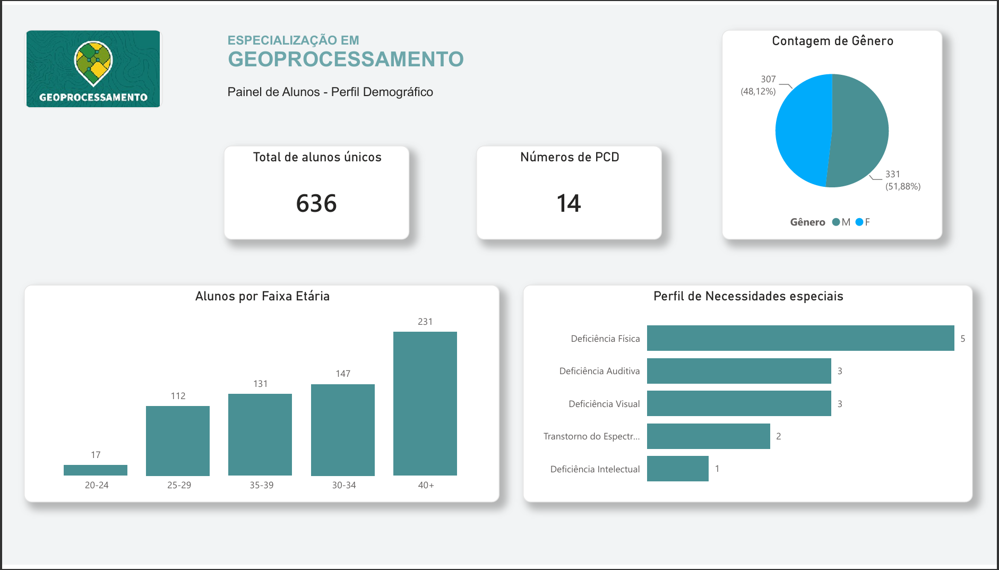
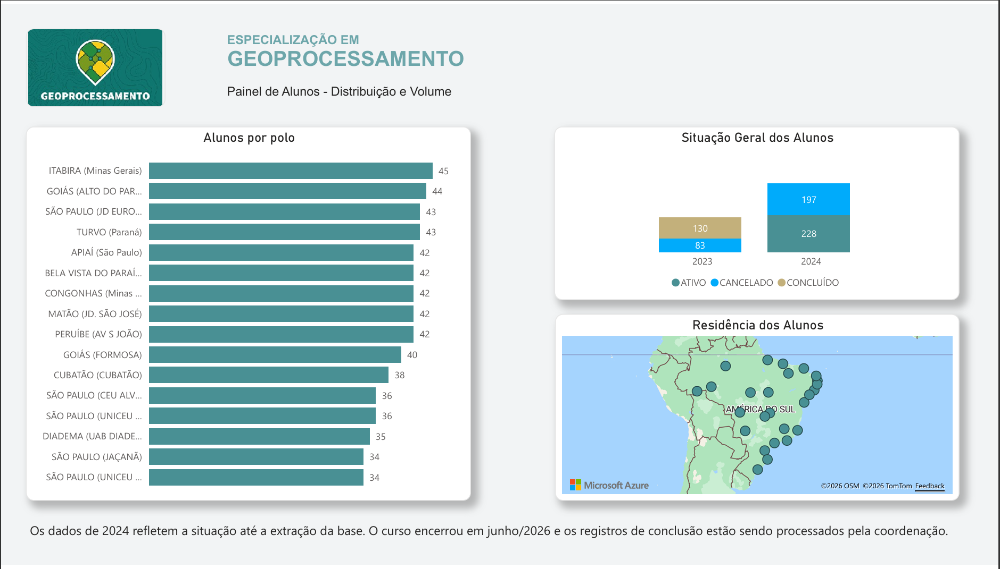
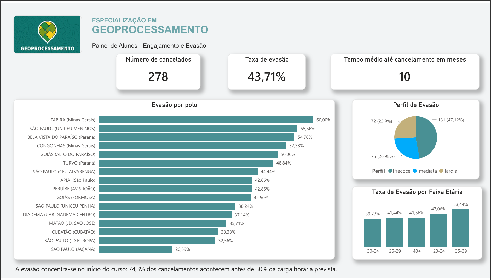
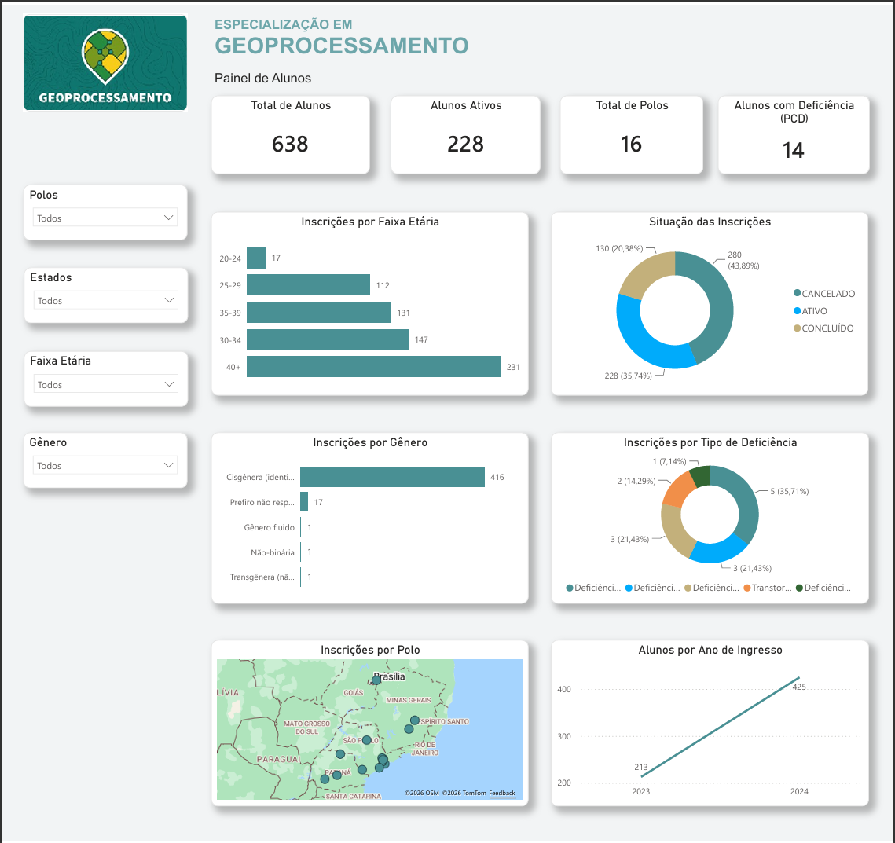

# 📊 Análise de Evasão — Especialização em Geoprocessamento (UAB/UFABC)

Projeto de análise de dados educacionais desenvolvido no contexto da **Universidade Aberta do Brasil (UAB/UFABC)**, com foco na identificação de padrões de evasão no curso de **Especialização em Geoprocessamento** (ofertas 2023 e 2024).

---

## 🎯 Objetivo

Transformar dados brutos de matrícula em insights estratégicos para apoiar a tomada de decisão da coordenação do curso, respondendo perguntas como:

- Qual é a taxa de evasão do curso?
- Em que momento do curso os alunos mais cancelam?
- Existem perfis distintos de evasão?
- Quais polos concentram mais cancelamentos?

---

## 🔍 Principais Insights

> **74,3% da evasão ocorre antes de 30% do percurso formativo**

| Perfil de Evasão | Alunos | % |
|---|---|---|
| Imediata (sem registro de carga horária) | 75 | 26,9% |
| Precoce (cancelamento antes de 30% do curso) | 131 | 47,1% |
| Tardia (cancelamento após 30% do curso) | 72 | 25,9% |

- **Taxa de evasão geral:** 43,71%
- **Tempo médio até o cancelamento:** 10 meses (em um curso de 24 meses)
- **Total de alunos únicos:** 636
- **Polos atendidos:** 16

---

## 📊 Dashboards

Duas versões foram desenvolvidas para públicos distintos:

| Versão | Público | Link |
|---|---|---|
| Painel Completo | Coordenação | [Acessar dashboard](https://app.powerbi.com/view?r=eyJrIjoiNDY2Njc0ZDAtNmRjZS00MWMxLWI3Y2MtNGZlN2VmNDNlOTJiIiwidCI6IjE2OGQ0MTM3LWQ2ZjYtNDVmOC1hYWE3LWQxYTcwMjMzMDk1ZSIsImMiOjR9) |
| Painel Resumido | Docentes | [Acessar dashboard](https://app.powerbi.com/view?r=eyJrIjoiZTdkZmRiOWItY2Y5MS00YjM2LWEwYzctMzk3MjIxZmQxZWU5IiwidCI6IjE2OGQ0MTM3LWQ2ZjYtNDVmOC1hYWE3LWQxYTcwMjMzMDk1ZSIsImMiOjR9) |

### Screenshots

**Painel da Coordenação**

| Perfil Demográfico | Distribuição e Volume | Engajamento e Evasão |
|---|---|---|
|  |  |  |

**Painel dos Docentes**

 

---

## 🛠️ Stack Utilizada

| Ferramenta | Uso |
|---|---|
| Python + Pandas | ETL, limpeza e transformação dos dados |
| Google Colab | Ambiente de desenvolvimento do pipeline |
| Power BI + Microsoft Fabric | Visualização e publicação dos dashboards |
| Excel | Fonte dos dados brutos |

---

## 📁 Estrutura do Projeto

```
educational-dropout-analysis/
│
├── notebooks/
│   └── etl_geoprocessamento.ipynb   # Pipeline ETL completo
│
├── dashboard/
│   ├── dashboard_coordenacao.pdf    # Versão PDF — Coordenação
│   ├── dashboard_docentes.pdf       # Versão PDF — Docentes
│   └── screenshots/                 # Prints das dashboards
│
├── docs/
│   └── metodologia.md               # Decisões técnicas e regras de negócio
│
├── .gitignore
├── requirements.txt
└── README.md
```

---

## ⚙️ Como Executar

1. Clone o repositório
```bash
git clone https://github.com/MuriScode/educational-dropout-analysis.git
```

2. Instale as dependências
```bash
pip install -r requirements.txt
```

3. Abra o notebook no Google Colab ou Jupyter
```
notebooks/etl_geoprocessamento.ipynb
```

4. Substitua os caminhos dos arquivos Excel pelos seus dados locais e execute as células em ordem.

> ⚠️ Os dados originais não estão disponíveis neste repositório por conterem informações pessoais de alunos (LGPD). O notebook utiliza dados anonimizados via hash SHA-256.

> ⚠️ O CSV é exportado com separador `;` e encoding `utf-8-sig` para compatibilidade com o Power BI em configurações regionais brasileiras.

---

## 📌 Contexto Institucional

Projeto desenvolvido no âmbito da **Universidade Aberta do Brasil (UAB)** em parceria com a **Universidade Federal do ABC (UFABC)**, com o objetivo de apoiar a gestão pedagógica e estratégica do curso de Especialização em Geoprocessamento.

---

## 👤 Autor

**Murilo Ribeiro Silva**  
[](https://linkedin.com/in/murilo-ribeiro-silva)
[](https://github.com/MuriScode)